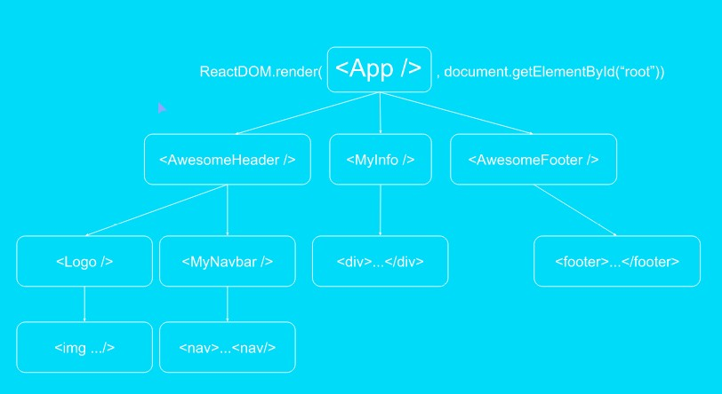

# Todolist

I am building a todolist in React.js to learn more about it, following a Scrimba course. 

## 1. Setup

1. Install Node (>= 8.10) and npm
2. VS code terminal, run:
    - npx create-react-app todolist OR npm init react-app todolist
    - cd todolist
    - npm start: runs the app in development mode on localhost 3000
3. cd todolist

## 2. Folder Structure

The create react app creates an entire folder structure from which you can begin to work. 

Inside the **'public'** folder there is one **index.html**. This is the only html page: React is a single page application framework.  This html page has to exist with this exact name and contains a **div element with id='root'**. All of the react output is rendered through this div - activated by index.js

Inside the **'src'** folder there is the **index.js** page. This has to exist with this exact name, contains the **javascript entrypoint**, and loads the App.js file.

The **App.js** is written with a capital - a convention is to write all React components with a capital letter. It contains the function App that return all react components - sort of a table of contents with all further elements. It gets rendered to your screen through the 'root' div. 

## 3. File Structure App.js

1. import React from 'react': this enables the system to read your JSX (this is the almost-html code you write in the js file)
2. import ReactDOM from 'react-dom'
3. Descride your function App

    function App() {
        return(
            Contains the content, you cannot have more than 1 element here so wrap inside a div.
            This usually contains a 'table of content', referring to other components that are again in another js file (structure clearly, make a component subdirectory) with the same structure as the app.js file.  
        )
    }

4. Export default App: makes it available for the other js files

## 4. Start creating components

### Structure

1. import React
2. function 'component name'
3. export default 'component name'

### Styling

You can add styling to your JSX **elements** similar as in html. Do not add them to the components.

- Watch out! Use className in stead of class!
- create an App.css file that styles the class
- inline styling never a good idea... clutters...

### JSX to Javascript and back

The JSX gets read as HTML, but I want a personal greeting... Therefor I want to use Javascript variables, and I can to this by placing them between { ... }

The variables are defined inside the function, above the return statement. 